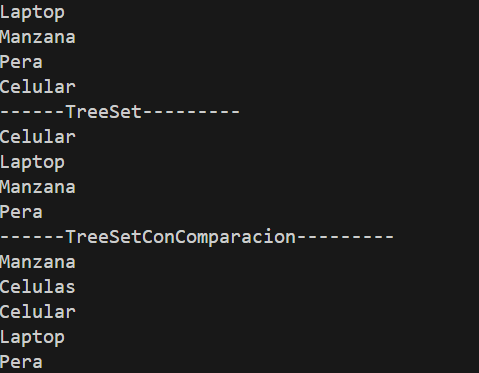

# Práctica de Sets

## 📌 Información General

- **Título:** Práctica de Sets
- **Asignatura:** Estructura de Datos
- **Carrera:** Computación
- **Estudiante:** [Sebastian Lopez]
- **Fecha:** [01/07/25]
- **Profesor:** Ing. Pablo Torres

---

## 🛠️ Descripción
Este proyecto implementa y compara diferentes String con Sets.


---

## 🚀 Ejecución

Para ejecutar el proyecto:

1. Compila el código:
    ```bash
    javac App.java
    ```
2. Ejecuta la aplicación:
    ```bash
    java App
    ```

---

## 🧑‍💻 Ejemplo de Entrada



```bash

-------TreeSet con Comparador--------
Pedro    Gonzales
Pablo    Lopez
Pedro    Lopez
Ana    Perez
Luis    Perez
--------TreeSet con comparador de telefono--------
Pedro    Gonzales
Pedro    Lopez
Pedro    Lopez
Pedro    Lopez
Ana    Perez
Luis    Perez
------TreeSetConComparadorHash---------
Pedro    Gonzales-----> -2038961063
Ana    Perez-----> 77069350
Luis    Perez-----> 79383301
Pablo    Lopez-----> 150474326
Pedro    Lopez-----> 150595598
PS C:\Users\LAB_04\Desktop\icc-est-u2-sets> 
```


